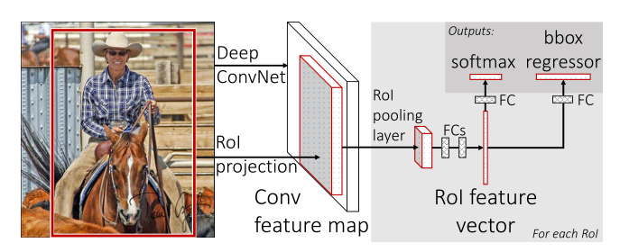
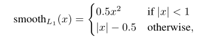
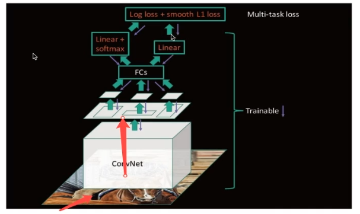
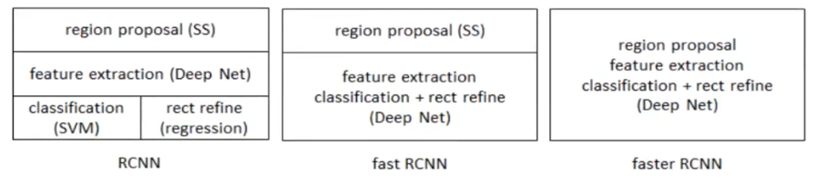
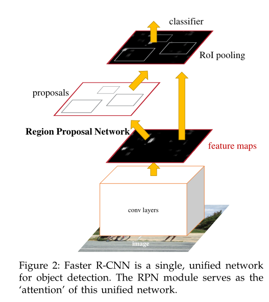
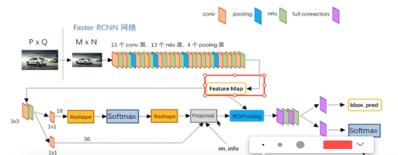
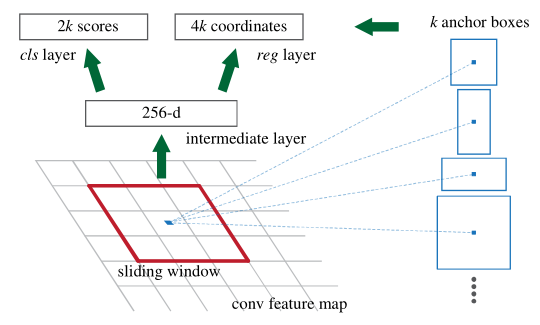
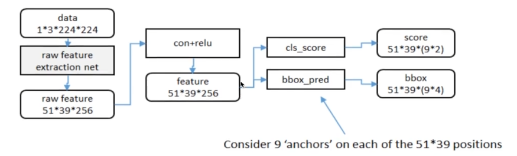

# Fast R-CNN and Faster R-CNN

[TOC]

## (一)Fast R-CNN

### 一.Fast R-CNN概述

Fast R-CNN是再在RCNN基础上结合SPPnet的经验改进而来的更快的RCNN目标检测算法，是一种用于对象检测的**基于快速区域的卷积网络**方法。于2015/9/27被发表。

有多快呢？Fast R-CNN训练非常深的VGG16网络比R-CNN快9倍，在测试时快213倍，并且在PASCAL VOC 2012上实现了更高的mAP。与SPPnet相比，Fast R-CNN训练VGG16快3倍，测试快10倍，同时更加准确。

#### 1.回忆RCNN和SPPnet

回忆一下RCNN的训练过程，我们不难看出：

- RCNN训练过程是多阶段性的。第一个阶段是使用CNN进行特征提取，第二阶段是进行SVM类别训练，三阶段是进行bbox回归训练。
- 训练的空间和事件成本都比较高。对于SVM和边界框回归器训练，从每个图像中的每个对象提议中提取特征并将其写入磁盘。对于非常深的网络，例如VGG16，对于VOC07训练集的5k图像，此过程需要2.5GPU天。
- 目标检测速度非常慢。使用VGG16进行检测需要47s/图像（在GPU上）。

SPPnet引入了特征金字塔结构层(SPP)，并且将整个图片输入CNN，而并非将单个先验框引入神经网络，简化了训练步骤，这种方法叫做多先验框训练**共享参数**。但是SPPnet也是有明显缺点：训练SVM和边界框回归器所使用的参数是无法更新空间金字塔之前的卷积层。这种限制（固定卷积层）限制了非常深的网络的准确性——一旦特征提取神经网络比较深的话，**需要训练参数量都集中在SPP前面的神经网络**。

#### 2.Fast-RCNN的主要优点

- 检测质量**（mAP）**高于R-CNN，SPPnet； 
- 培训是单阶段的，使用**多任务损失**；
- 培训可以**更新所有网络层**；
- 特征缓存**不需要磁盘存储**。

### 二.Fast R-CNN算法结构和训练策略

#### 1.ROI pooling

ROI是一个简单版本的SPP层结构，目的是在SPP基础上能够使得计算时间变少并且得出固定长度。 

但是ROI是在SPP的基础上 ，去除了多尺度的金字塔模型，只保留了单个4\*4的块并使用最大池化将特征图转换为具有固定大小(H\*W)的特征图——H和W属于超参数，需要我们自行设定。

文章中所使用的是H=W=7的草参数，那么该过程根据SPPnet和原论文：将输出的特征图分成h\*w的网格，每个网格大小为：
$$
[width_{fm}/w,hight_{fm}/h]
$$
在SPP基础上，可以看得到，ROI主要改进在于：

- 不再对每一个先验框进行尺度统一，而是对**整个特征图**进行尺度统一。这样就消除了因先验框之间重复率较高而导致的重复计算次数增加的问题。
- 同时改**多尺度统一**为**单一尺度统一**。

#### 2.改用softmax

Faster RCNN在得到了尺度统一的Feature map后，其前向传播分为两支——一支进行bbox的regression，另外一支进行classification但是需要注意的是，这里的分类需要加上背景，也就是num_classes+1个类别。

#### 3.Fine-tuning实现端到端的雏形

我们上一篇SPPnet讲到过，SPPnet和RCNN都逃不过**三阶段**——候选区域获取、特征提取、分类+regression。Fast RCNN的一大优点是实现了后两个阶段参数共享，也就是成为了个人认为真正意义上的**two-stage目标检测算法**。

根本原因是当每个训练样本（即RoI）来自不同的图像时，通过SPP层的反向传播效率非常低。效率低下的原因在于每个RoI可能具有非常大的感受野，通常跨越整个输入图像。由于正向通过必须处理整个感受野，因此训练输入很大（通常是整个图像）。

Fast-RCNN根据SPPnet无法更新特征提取CNN的参数的缺点，就把所有的特征存储到内存当中，不占用磁盘空间，并考虑到SPP不适合反向传播调参，就使用了ROI pooling，从而形成了End-to-end的结构，但是并不是真正意义上的端到端，因为还是要通过SS来完成候选区域的筛选。

#### 4.多任务损失

对于分类loss，网络端输出是一个N+1的softmax输出，其中N就是类别个数，1是背景，使用交叉熵损失。对于没有物体的region，如果标记为0，说明什么都没有，那么就是背景。

对于回归loss，网络端输出是一个4\*N的回归器输出张量，每一个类别会单独训练一个regressor，使用Smooth L1 loss函数。

### 三.总结

Fast R-CNN整体训练过程是：

首先，将原始图片一部分用于SS提取候选区域，另一部分被整张输入CNN进行特征提取。

然后，将提取到的特征图进行尺度统一或者叫做区域归一化，注意在这之前需要对先验框完成SPPnet中讲到过的的映射，

再者，通过多个全连接层后，一个分支继续通过全连接层并进行softmax分类，另一分支用于bbox回归。

最后，分别计算得到相应的loss，相机加输出为一个loss，最后通过反向传播微调参数。

至于Fast R-CNN的优缺点：

- 优点：
  1. 一定程度上，较大幅度地提高了训练和测试速度；
  2. mAP有一定提升，但是不够。
- 缺点：仍然使用的是Selective Search进行先验框提取，这个过程非常繁琐且耗时较长，不能称为真正意义上的端到端。

## (二)Faster R-CNN

Faster R-CNN与Fast R-CNN相比，大的改进之处基本上只有RPN的提出。

RPN(region proposal network)为区域建议神经网络，也就是说之前使用选择性搜索算法实现先验框的提取，现在直接改用了用神经网络来完成。它的提出，实现了RCNN网络的一个整合化，基本上实现了端到端的目标检测算法。

### 一.Faster R-CNN的训练过程

首先我们需要向VGG-16输入**任意大小**的图片——注意这里不向前两个版本的RCNN需要有两个分支。

我们继续，输入到CNN(VGG-16)进行特征提取后，得到Feature map，从这里开始才会有两个分支，一个分支进入RPN进行先验框的提取然后通过ROI pooling；另外一个分支，会直接通过ROI pooling。

再者，将两个分支的信息张量进行映射——还是SPP的映射哦，通过一部分全连接层后，分为两个分支，一个分支是bbox预测回归器(linear)，另一个是分类器(linear+softmax)。

最后，计算分类loss和回归loss，反向传播微调参数，重复循环这个过程。

### 二.RPN结构（重点）

RPN将（任何大小的）图像作为输入并输出一组矩形对象先验框，每个先验框都有一个对象分数。

RPN提取先验框的过程分为两个部分：

- 使用n\*n(默认为3,3)大小的窗口去扫描特征图，将每一个滑动窗口的位置映射到一个低维的向量（默认为256），并为每一个滑动窗口位置考虑k种(默认为9)可能的参考窗口——3种尺度、3种大小。这个就是yolov2沿用Faster R-CNN的**anchors**。
- 低维特征向量输入两个并行的1\*1卷积得出两个部分：regression窗口回归层(修正位置)+种类窗口分类器。

#### 1.RPN前向传播

这是up主的原笔记，说老实话：不是非常理解，所以我结合着原论文用自己的话语理解了一下：

- RPN输入任意大小的图像，然后用一个**微型网络**，去扫描输入特征图，每一个滑动窗口都要通过卷积运算将特征张量映射到一个拥有较低通道数的张量，比如说原来可能是1024通道，那么RPN的intermediate layer就得把通道数降低到512(VGG的话)；
- 然后这个输出的特征图继续向前传播，但是分为两个分支：
  1. 一个输入到bbox regression全连接层；
  2. 另外一个输入到类别classification全连接层。

#### 2.anchor

在刚刚的滑动过程中3，3的卷积核的中心点对应原图上的位置，将该点作为anchor的中心点，在原图中框出多尺度、多种长宽比的anchors，有三种尺度(128,256,512)，三种长宽比(1:1,1:2,2:1)。

也就是说：每一个滑动窗口的中心点会得到9中不同形状的anchor。

#### 3.RPN反向传播矫正数据

训练样本标记：

- 与label bbox有着最高IoU的anchor记为正样本；
- 剩下的anchor/anchors与任意一个label bbox的IoU大于0.7的记为正样本，小于0.3的话记为负样本。
- 剩下样本忽略。
- 正负样本比例保证为1：3

训练损失：

- 对于每个物体的分类，仅需要完成有无物体的二分类即可；
- 另一方面就是对每个标注物体的bbox进行回归；
- 这 里的所使用的loss函数跟Fast R-CNN类似。

### 三.总结

优点：

- 提出了RPN网络；
- 基本实现了端到端的网络模型；
- 速度进一步提升。

缺点：

- 训练参数过大；
- 对于实际应用来说，训练过程仍然比较麻烦、耗时间。

 学习资料：

- Faster R-CNN、Fast R-CNN原论文
- [B站视频](https://www.bilibili.com/video/BV1qg411M75b?p=22)
