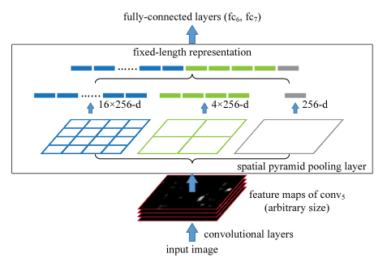
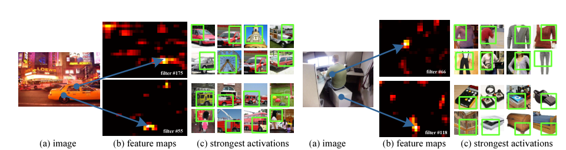
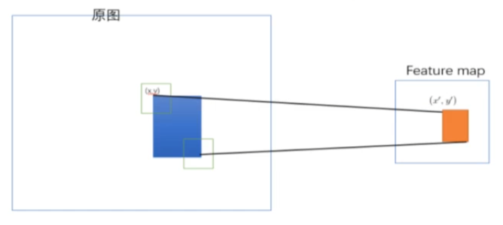
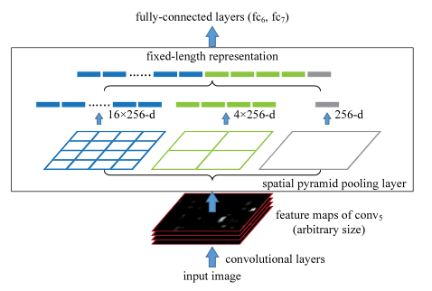
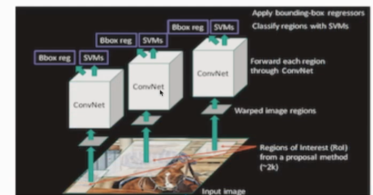
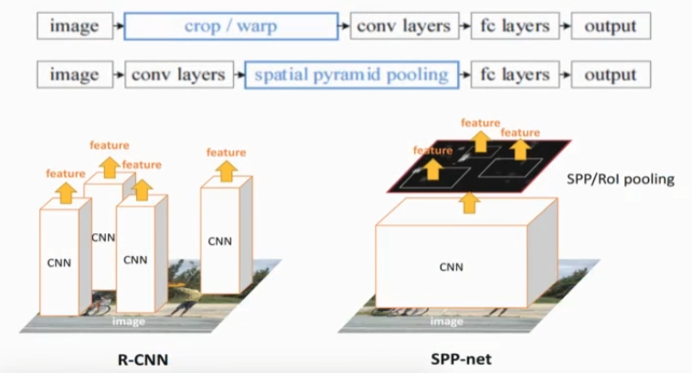
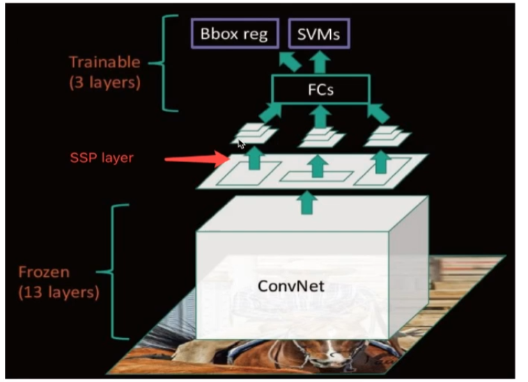

# SPPnet-object detection

[TOC]

本文主要针对SPPnet在目标检测领域的应用进行讲解，对于文本分类方面的词袋模型等知识不做过多讲解，所以说部分内容有所删减。

## 一.概述

SPPnet全称**Spatial Pyramid Pooling in Deep Convolutional Networks for Visual Recognition**，翻译过来就是：深度卷积神经网络中的用于视觉识别的空间金字塔池化。于2015年被大佬何凯明的团队提出。

目前的深度学习神经网络需要固定的输入，那么对于我们目标检测需要检测的bbox，bbox就相当于**子图**，那么在这个过程中**bbox子图会随着整张图片一起变形**，可能会降低识别精度（可以使用的信息减少了）。

SPPnet的提出就是为了解决该项问题，并且通过实验也验证了SPPnet对于不用大小/比例的图片，效果都很不错。

## 二.提出理由

概述里面我们已经讲到了：SPPnet提出就为了让CNN在保证近乎相同预测效果的前提下可以处理不同大小的图片。

当时，人们对于固定输入图片大小的方式主要有crop和warp这两种方式，也就是**剪裁、翘曲**。对于剪裁，可能无法将整个标注对象给剪裁进去；对于翘曲，可能导致不希望的**几何失真（图像被过渡拉伸或者通过其他方式而变得看起来<u>不正常</u>）**。

那么为什么CNN一定要固定输入输出大小呢？因为对于CNN，其主要有两部分——卷积层和全连接层。卷积层完成特征提取，其中包括卷积和池化等结构，但完成下采样的主要结构也就是完成图片尺寸压缩、维度升高的主要是卷积、池化；全连接层完成特征向量的分类，进行一个矩阵运算。

对于卷积层，输入任何大小的图片都可以输出一个张量，但是对于全连接层，对于图像分类，全连接层需要完成的是一个classifier的功能，那么input_feature和output_feature都是确定的，也就是输入、输出的特征向量的长度都是固定的。因此，对于卷积神经网络，**真正需要固定图像大小的部分其实是全连接层**。

本文介绍的SPPnet主要就是在RCNN的基础上增加了**SPP层**。

SPP层汇集特征并生成固定的长度特征图输出，然后再汇入全连接层。换句话说，就是在网路结构的更深层次（卷积层和全连接层交界处）执行**信息的结合**，以避免了在开始就需要剪裁、变形。

SPP(Spatial pyramid pooling)也被人们熟知为：SPM(Spatial pyramid matching，是词袋模型的一种扩展)，他将图像划分为从更精细到更粗糙的级别，并汇总其中的局部特征。

## 三.拥有空间金字塔池化的深度网络

### 1.卷积层和特征图

当时流行的是“7层结构”，即5层卷积层，2层全连接层。

这张论文中的图片可视化了网络前向传播过程中的部分输出特征图，说明了一些filter可以被一些特定的语义信息给激活。比如说图中的出粗车和座椅激活了过滤器。

### 2.映射

在SPPnet中，原始图片一方面需要输入CNN（期间有SPP层）得到feature map，一方面通过选择性搜索得到候选区域。你现在有两个东西，但是输入全连接层进行分类和回归需要的单个特征向量，那么你就需要对得到的先验框，进行一个操作：**原图先验框 -> 特征图上的先验框**，这就是一个映射。

其实这个过程不难，类似于目标定位中讲过的对bbox的reshap，因为原图到特征图的变换就类似于一次resize，resize的尺度就是——**CNN中卷积层所有的下采样倍数的倒数**，比如说对于”7层模型“，有5个卷积层，有5次下采样那么需要将图片缩小32倍，记为**S**，那么图中的(x,y)=(s\*x',s\*y):
$$
左上角的点:x'=[\frac{x}{s}]+1
\\
右下角的点:x'=[\frac{x'}{s}]-1
$$

### 3.SPP层

卷积层需要接受任意的输入大小，但是产生的是不确定尺寸大小的特征图，而后续的全连接层或者是SVM分类器的输入应该是固定的。

我们假设SPP层接受conlayer处理得到的(13,13,256)的输出特征图，那么需要对每一个候选区域进行读入并分块——(4,4+2,2+1,1)，那么每一个块尺寸为(13/4,13/4+13/2,13/2+13/1,13/1)=(3,3+6,6+13,3)。

然后对这三种尺度的块进行最大池化，比如说对于(4,4)的块，一共16个网格，每个网格中去除最大值作为该网格代表，那么就有16*256个最大值，同理2,2和1,1网格分别得到4\*256和1\*256的最值，最后合并就可以得到21\*256的与尺寸无关的特征向量。

**SPP会替换了“7层模型”网络中第五层卷积的最后一个池化操作**。SPP结构不仅允许任意纵横比，而且允许任意尺度，我们可以将输入图像的大小调整为任意比例。同时，我们发现最粗糙的级别——也就是图中256-d级别实际上是一个全局平均化，**使用卷据平均池化可以减少模型大小并减少过渡拟合**。

## 四.总结

SPPnet有效地解决了RCNN中区域裁剪于缩放等操作带来的弊端，相较于RCNN而言，SPPnet有两大贡献：

- 将图片一张整输入到CNN中，再进行选择性搜索并使用先验框从原图到特征图的**映射**——大大减少了一张图片的特征提取次数。

  

- 提出了SPP层结构，解决了图像尺寸输入CNN前的预处理问题。

缺点也很明显：

- **部分参数无法训练**：只是在RCNN基础上改进，并没有实现端到端的训练过程，**CNN只是起到了特征提取的过程**，其参数在训练过程中无法训练。
- **训练过程繁琐**：训练过程依然是分两个阶段，获取特征的过程依然比较慢并且需要将特征存储到磁盘中去，然后再取出来进行训练，这个过程依旧比较繁琐。

学习资源：

- SPPnet原论文
- [SPPnet原论文讲解](https://blog.csdn.net/alibabazhouyu/article/details/80058009?ops_request_misc=%257B%2522request%255Fid%2522%253A%2522164655405016780269828978%2522%252C%2522scm%2522%253A%252220140713.130102334..%2522%257D&request_id=164655405016780269828978&biz_id=0&utm_medium=distribute.pc_search_result.none-task-blog-2~all~sobaiduend~default-1-80058009.es_vector_control_group&utm_term=sppnet%E8%AE%BA%E6%96%87&spm=1018.2226.3001.4187)

- [B站视频-目标检测算法](https://www.bilibili.com/video/BV1qg411M75b?p=14)

